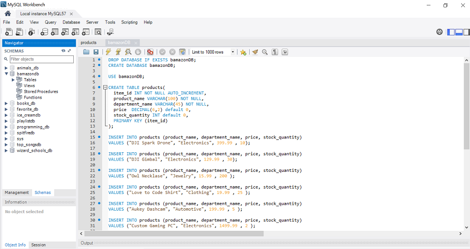
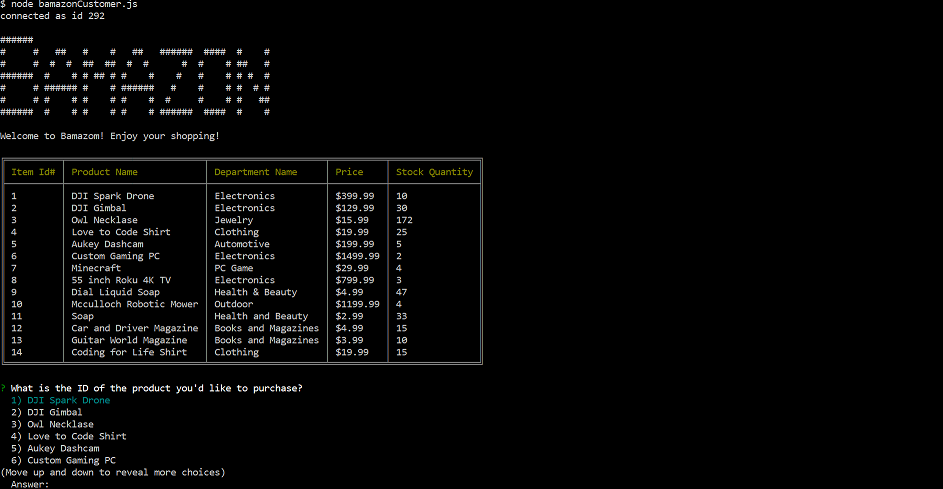
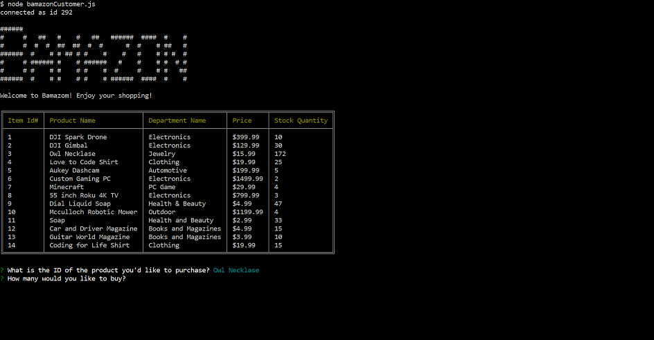
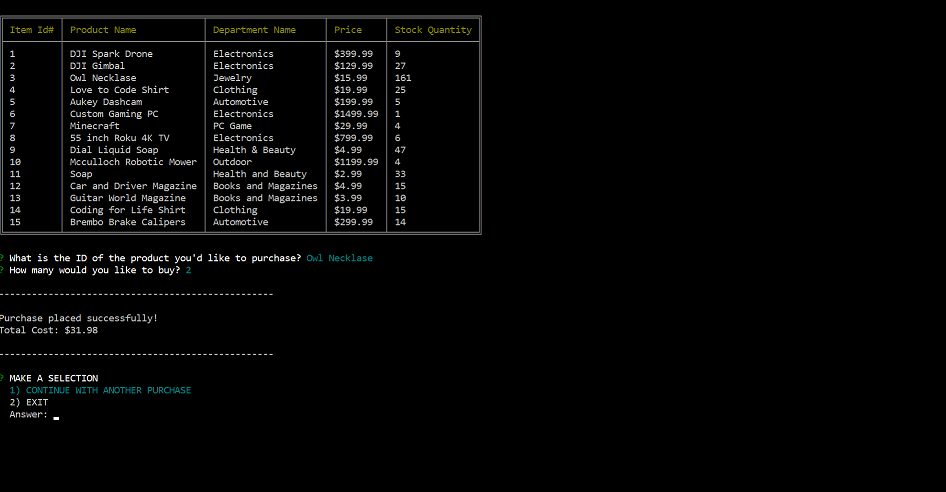
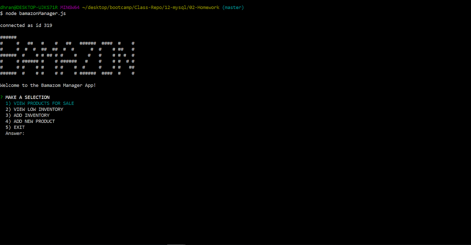
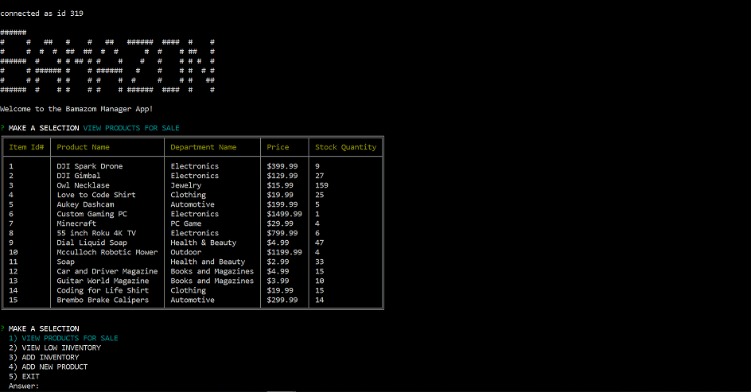
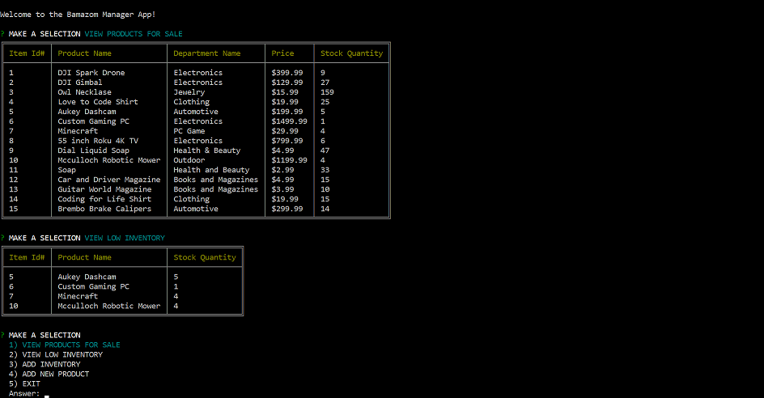
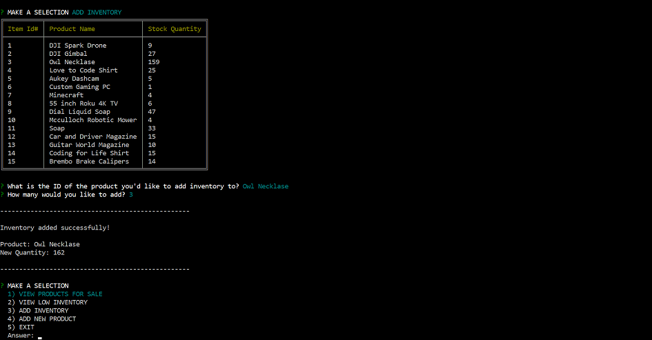
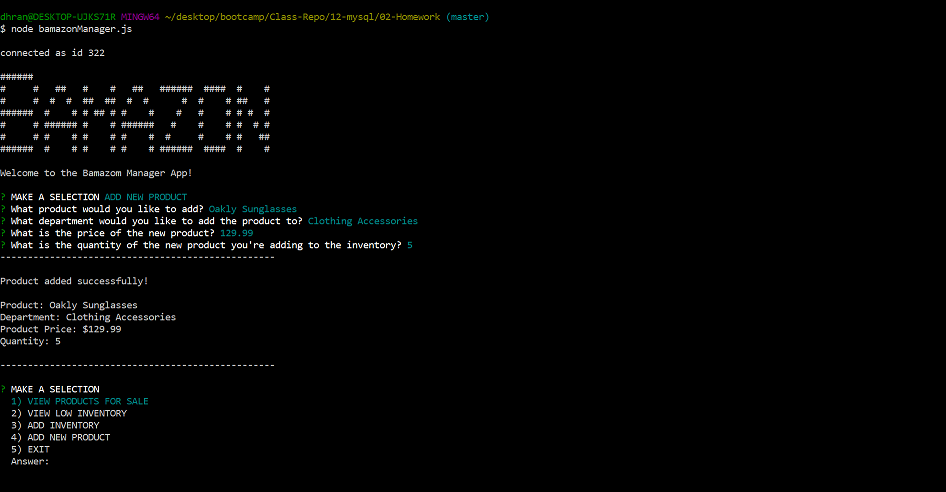

# Bamazon

## Description

This application implements a simple command line based storefront using the npm [inquirer](https://www.npmjs.com/package/inquirer) package and the MySQL database backend together with the npm [mysql](https://www.npmjs.com/package/mysql) package. The application presents two interfaces: **customer** and **manager**.

### MySQL Database Setup

In order to run this application, you should have the MySQL database already set up on your machine.  You will be able to create the *Bamazon* database and the *products* table with the SQL code found in [bamazonDB.sql](bamazonDB.sql). Run this code inside your MySQL client to populate the database, then you will be ready to proceed with running the Bamazon customer and manager interfaces.

**MySQL Database Setup Screenshot**

### Customer Interface

The customer interface allows the user to view the current inventory of store items: item IDs, descriptions, department in which the item is located and price. The user is then able to purchase one of the existing items by entering the item ID and the desired quantity. If the selected quantity is currently in stock, the user's order is fulfilled, displaying the total purchase price and updating the store database. If the desired quantity is not available, the user will be notified via the command prompt that the inventory is low for that item.

To run the customer interface please follow the steps below:

	git clone https://github.com/dhrandy/bamazon.git
	cd bamazon
	npm install
	node bamazonCustomer.js or just bamazonCustomer

**Start of Customer App**

**Selecting**

**Order Complete**

### Manager Interace

The manager interface presents a list of four options, as below. 

	? Please select an option: 
	❯ VIEW PRODUCTS FOR SALE 
	  VIEW LOW INVENTORY
	  ADD INVENTORY
	  ADD NEW PRODUCT
	  EXIT
	  
The **View Products for Sale** option allows the user to view the current inventory of store items: item IDs, descriptions, department in which the item is located, price, and the quantity available in stock. 

The **View Low Inventory** option shows the user the items which currently have fewer than 5 units available.

The **Add to Inventory** option allows the user to select a given item ID and add additional inventory to the target item.

The **Add New Product** option allows the user to enter details about a new product which will be entered into the database upon completion of the form.

The **Exit** option allows the user to exit the program.

To run the manager interface please follow the steps below:

	git clone https://github.com/dhrandy/bamazon.git
	cd bamazon
	npm install
	node bamazonManager.js or just bamazonManager

**Start of Manager App**

**View All Products**

**View Low Inventory**

**Add Inventory**

**Add New Product**
